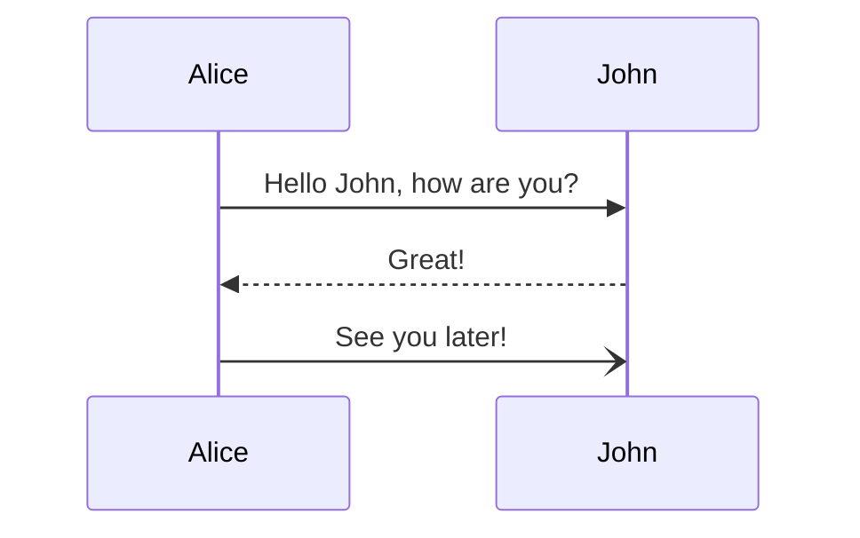

+++
title = 'Beware the Mermaid!'
description = 'Show an example of a rendered Mermaidjs diagram.'
author = 'Brieuc Desoutter'
date = 2024-05-08T09:47:17+03:00
draft = true
tags = ["web", "diagram"]
+++

## What are you talking about ? 

I am talking about the [mermaid](https://mermaid.js.org), the javascript diagramming framework!

Here is an example:

